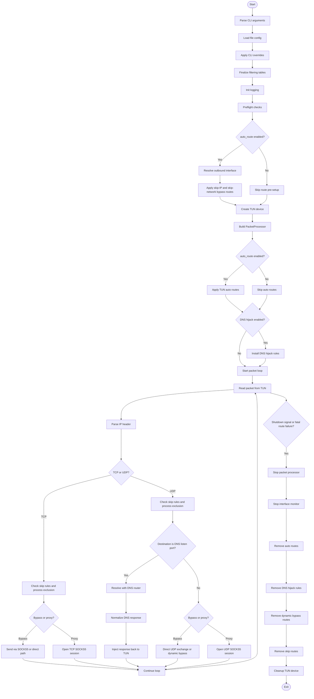

# How TinyTun Works

This document summarizes the runtime workflow of TinyTun based on the current codebase.

## Overview

TinyTun is a transparent proxy runner built around four main stages:

1. Load configuration and initialize logging.
2. Prepare network state, including routes, TUN, and optional DNS hijack rules.
3. Read packets from the TUN device and decide how each flow should be handled.
4. Clean up routes and system rules on shutdown.

The main execution path starts in `main.rs`, creates a TUN device, builds the packet processor, then continuously processes traffic until a shutdown signal arrives.

## Startup Flow

### 1. Parse CLI and load configuration

The application accepts `run` as its main subcommand. Configuration comes from a file first, then CLI flags override file values.

Important merge rules:

- CLI values override file values.
- When `--default-interface` is set without `--auto-detect-interface`, TinyTun switches to manual interface mode.
- The TUN address and proxy addresses are always added to the skip list so they are never captured back into the tunnel.
- `FilteringConfig::finalize()` rebuilds the runtime lookup structures after all config mutations.

### 2. Run preflight checks

Before creating the tunnel, TinyTun verifies that the SOCKS5 endpoint is reachable. On Windows, it also checks for administrator privileges and `wintun.dll` availability.

### 3. Prepare routing state

If `tun.auto_route` is enabled, TinyTun resolves the outbound physical interface and applies bypass routes before creating the TUN device.

This stage handles:

- explicit skip IP routes
- skip network routes
- outbound interface selection
- route switching when the physical interface disappears

### 4. Create the TUN device

`TunDevice::new()` builds the virtual interface with the configured IPv4 and optional IPv6 settings.

### 5. Build packet-processing state

`PacketProcessor::new()` creates:

- the SOCKS5 client
- the DNS router
- the process lookup helpers
- the TUN write queue
- session caches and concurrency limiters

### 6. Apply auto route and DNS hijack rules

After the TUN device exists, TinyTun can:

- install automatic default routes through the TUN interface
- attach DNS hijack rules so local DNS traffic is forced into the tunnel path
- start the interface monitor that re-applies bypass routes when the outbound interface changes

## Runtime Packet Flow

Packets are read from the TUN device in a loop.

1. The packet is parsed as IPv4 or IPv6.
2. Destination IP and destination port are checked against the skip lists.
3. The protocol is dispatched to TCP or UDP handling.
4. Matching flows are either proxied, bypassed, or handled specially.

### TCP flow

TCP packets are routed through the SOCKS5 client unless they match a bypass rule.

Main behaviors:

- excluded processes can be bypassed
- TCP sessions are tracked and cleaned up when idle
- sequence numbers and reordering are handled so replies can be written back to TUN correctly

### UDP flow

UDP packets follow three major paths:

- excluded process traffic can go directly through the physical interface when available
- DNS packets are intercepted and resolved through the DNS router
- normal UDP flows are proxied through SOCKS5 UDP associate sessions

If auto route is enabled and direct forwarding is not available, TinyTun installs a dynamic bypass route for the destination IP so future packets avoid the tunnel.

### DNS flow

DNS handling is one of the most important runtime paths.

1. UDP packets on the configured DNS listen port are intercepted.
2. The raw DNS payload is passed to `DnsRouter::resolve()`.
3. The DNS router applies cache lookup and routing rules.
4. The selected upstream group is queried with the configured strategy.
5. The response is normalized to match the client query and injected back into TUN.

If resolution fails, TinyTun returns a spoofed SERVFAIL response instead of dropping the query silently.

## DNS Router Logic

The DNS router works in this order:

1. Parse the DNS question.
2. Check the TTL-aware response cache.
3. Match the domain against routing rules.
4. Choose the target DNS group.
5. Query the group using one of three strategies:
   - concurrent
   - sequential
   - random
6. Cache successful responses using the minimum TTL from the answer.

Routing rules can use:

- exact domain match
- suffix match
- keyword match
- regex match
- geosite category match
- wildcard match

A rule can either forward to a DNS group or reject the query with NXDOMAIN.

## SOCKS5 and Routing

TinyTun uses SOCKS5 for both TCP and UDP proxying.

Key ideas:

- TCP flows use a SOCKS5 CONNECT session.
- UDP flows use SOCKS5 UDP ASSOCIATE sessions.
- When an outbound interface is known, SOCKS5 sockets may be bound to that interface so proxy traffic does not loop back into the TUN device.

## Process Exclusion

There are two exclusion paths:

- configuration-based process exclusion
- optional Linux eBPF-based process exclusion

When eBPF is enabled, TinyTun loads the pre-built program, attaches cgroup hooks, and populates the exclusion map with process names. This allows the kernel path to bypass the tunnel before packets reach user space.

## Shutdown Flow

Shutdown is triggered by either:

- Ctrl+C
- SIGTERM
- a routing failure reported by the interface monitor

Cleanup happens in this order:

1. Stop the packet processor.
2. Stop the interface monitor.
3. Remove automatic routes.
4. Remove DNS hijack rules.
5. Remove dynamic bypass routes.
6. Remove configured skip routes.
7. Destroy the TUN device.

This order avoids leaving new dynamic routes behind while cleanup is in progress.

## Mermaid Flowchart

## Practical Run Order

If you want to operate TinyTun safely, follow this order:

1. Prepare the SOCKS5 proxy.
2. Confirm routing permissions and root privileges.
3. Start TinyTun with the desired config.
4. Verify the TUN interface is up.
5. Confirm DNS queries and proxied traffic are flowing as expected.
6. Watch the logs for route-switch or DNS hijack warnings.

## Notes

- DNS hijack and auto route are optional, but they materially affect how local traffic is captured.
- The code is designed to avoid routing loops by skipping the TUN address, proxy addresses, and selected outbound interfaces.
- The actual behavior depends heavily on the configured skip lists, DNS groups, and whether process exclusion is enabled.
